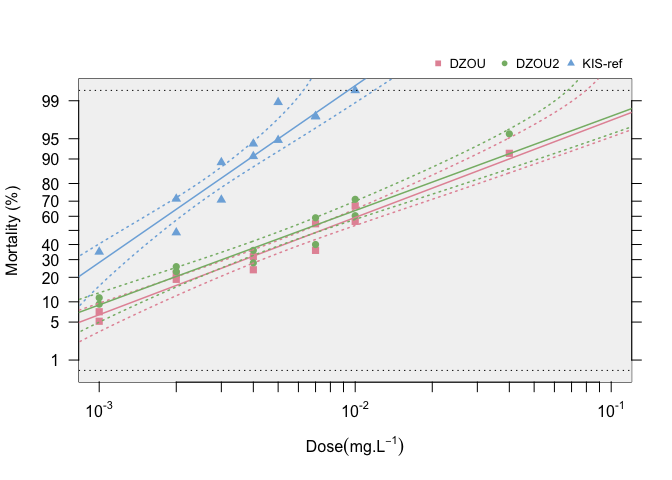

<!-- badges: start -->

<!-- badges: end -->

**BioRssay** will help you to analyze mortality data from bioassays of
any kind (e.g.,insecti/pesti/herbi-cides, antibiotics, etc.).

***For a comprehensive tutorial on the package, go to
<https://milesilab.github.io/BioRssay/> and navigate to “Get started”
where all the functions and usage are explained with ample examples.***

**Installation**

-   CRAN link <https://cran.r-project.org/package=BioRssay>

<!-- -->

    install.packages("BioRssay")

-   You can install the development version of rCNV from
    [GitHub](https://github.com/) with:

<!-- -->

    if (!requireNamespace("devtools", quietly = TRUE)) 
        install.packages("devtools") 
    devtools::install_github("milesilab/BioRssay", build_vignettes = TRUE)

Please don’t forget to cite us if you use the package.

**How to cite**

Karunarathne, P., Pocquet, N., Labbé, P. et al. BioRssay: an R package
for analyses of bioassays and probit graphs. Parasites Vectors 15, 35
(2022). <https://doi.org/10.1186/s13071-021-05146-x>
