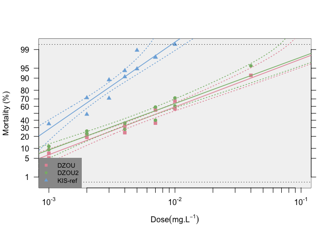

<!-- badges: start -->

<!-- badges: end -->

**BioRssay** will help you to analyze mortality data from bioassays of
any kind (e.g.,insecti/pesti/herbi-cides, antibiotics, etc.).

***For a comprehensive tutorial on the package, go to
<a href="https://milesilab.github.io/BioRssay/" class="uri">https://milesilab.github.io/BioRssay/</a>
and navigate to “Get started” where all the functions and usage are
explained with ample examples.***

**Installation**

    if (!requireNamespace("devtools", quietly = TRUE)) 
        install.packages("devtools") 
    devtools::install_github("milesilab/BioRssay")

Please don’t forget to cite us if you use the package.

**How to cite**

\*Publication to be added
