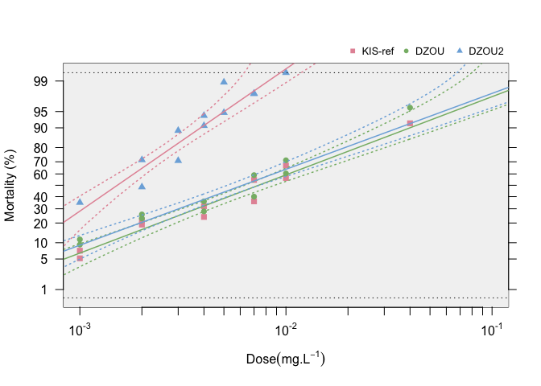

**BioRssay** will help you to analyze mortality data from bioassays of
any kind (e.g. insecti/pesti/herbi-cides, antibiotics, etc.).

Mortality plot

For a comprehensive tutorial of the package, navigate to “Get started”
where all the functions and usage is described with ample examples.

**Installation**

    if (!requireNamespace("devtools", quietly = TRUE)) 
        install.packages("devtools") 
    devtools::install_github("milesilab/BioRssay")

Please don’t forget to cite us if you use the package.

**How to cite**

\*Publication to be added
